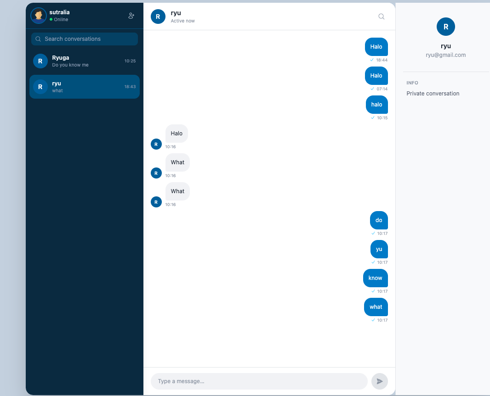

# Chat Room — Frontend

A real-time chat application built with React and WebSocket.

## Preview



## Tech Stack

- **React 18** + React Router DOM v6
- **Material-UI (MUI) v5** for UI components and theming
- **WebSocket** via `react-use-websocket` for real-time messaging
- **Axios** for REST API calls
- **Vite** as the build tool and dev server
- **date-fns** for timestamp formatting

## Features

- Join a chat room with a username and room ID
- Real-time messaging over WebSocket
- Message history loaded on join
- Left/right message bubbles distinguishing other users from yourself
- Protected routes — requires authentication to access the chat

## Getting Started

### With Docker

```bash
docker-compose up --build --no-recreate -d
docker-compose ps
docker exec -it vite_docker sh
yarn
yarn dev
```

### Without Docker

```bash
yarn
yarn dev
```

The app runs on **http://localhost:8000**.

> Make sure the backend is running on `http://localhost:3000` before starting.

## Project Structure

```
src/
├── components/
│   ├── Chat.jsx          # Main chat view with WebSocket connection
│   ├── ChatInput.jsx     # Message input with Enter-to-send
│   ├── Message.jsx       # Left/right message bubble components
│   ├── Login.jsx         # Username + room ID login form
│   └── ProtectedRoute.jsx
├── context/
│   └── AuthContext.jsx   # Auth state via React Context + localStorage
├── services/
│   └── api.js            # Axios instance (base: http://localhost:3000/api/)
└── App.jsx               # Theme config and route setup
```

## Environment

No `.env` file required for local development. The backend URL is configured in `src/services/api.js` and the WebSocket URL in `src/components/Chat.jsx`.

| Variable | Default |
|----------|---------|
| API base URL | `http://localhost:3000/api/` |
| WebSocket URL | `ws://localhost:3000/chats` |
| Dev server port | `8000` |
